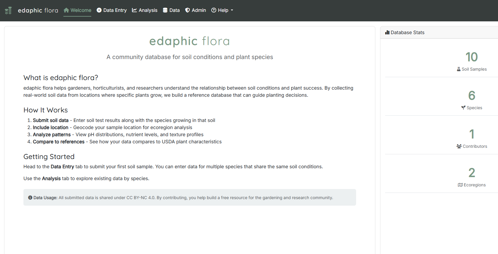
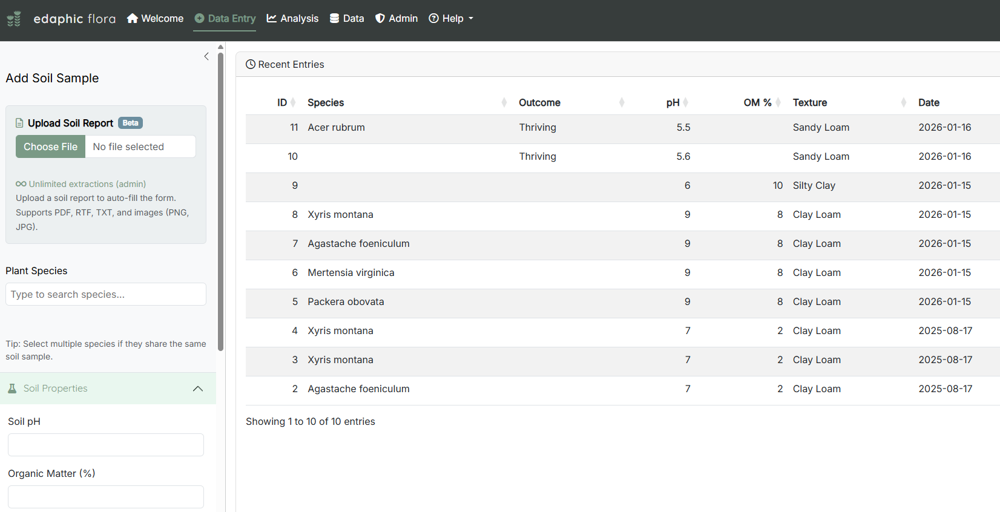
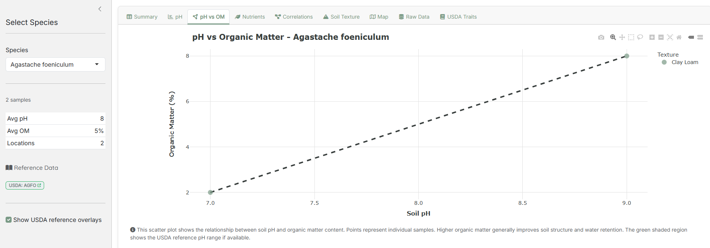
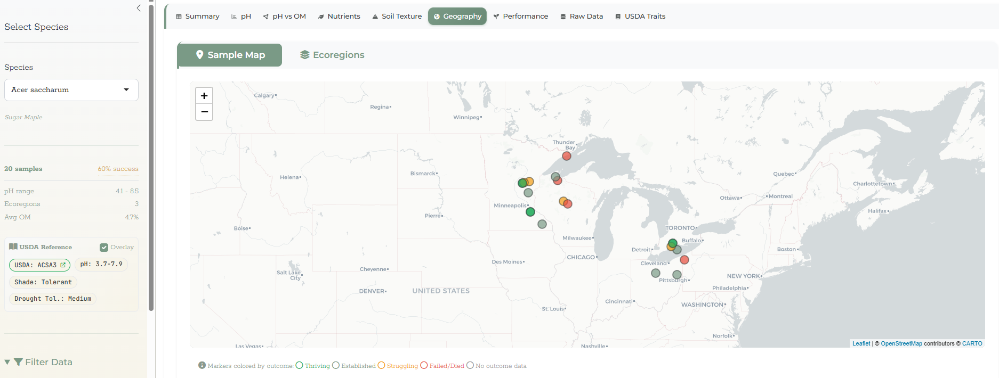

<p align="center">
  
</p>

<p align="center">
  <strong>A community-driven soil database for native plant enthusiasts</strong>
</p>

<p align="center">
  <a href="https://buymeacoffee.com/toddtesterman"></a>
  <a href="https://www.gnu.org/licenses/agpl-3.0"></a>
</p>

---

edaphic flora is an open-source R Shiny application for recording and analyzing soil conditions where plants grow. By crowdsourcing soil data from real growing locations, we're building a resource to help people understand what soil conditions different species actually thrive in—not just what's listed in general references.

> *"Edaphic" means relating to the soil, especially as it affects living organisms.*

## Features

- **Multi-species soil data entry** - Record soil samples for up to 20 species at once
- **AI-powered soil report extraction** - Upload PDF, RTF, or image files from soil labs and auto-extract values
- **Interactive visualizations** - pH distribution, nutrient analysis, soil texture ternary diagrams, correlation heatmaps
- **Geographic mapping** - Leaflet maps with automatic geocoding and EPA Level IV ecoregion detection
- **USDA integration** - Reference data for soil/climate preferences and wetland indicators
- **Species validation** - 360K+ accepted species from World Checklist of Vascular Plants (WCVP)
- **Data management** - CSV import/export with bulk data handling
- **User accounts** - Firebase authentication with edit/delete capabilities for your own data

## Screenshots

<p align="center">
  
  <br><em>Welcome page with database statistics and sample locations map</em>
</p>

<p align="center">
  
  <br><em>Data entry with PDF upload and filterable data table</em>
</p>

<p align="center">
  
  <br><em>Nutrient analysis with USDA reference data overlay</em>
</p>

<p align="center">
  
  <br><em>Geographic distribution with EPA ecoregion mapping</em>
</p>

## Technology Stack

| Category | Technologies |
|----------|-------------|
| **Framework** | R Shiny, bslib (Bootstrap 5) |
| **Database** | PostgreSQL (Neon), pool, RPostgres |
| **Visualization** | ggplot2, plotly, ggtern, leaflet, DT |
| **Geospatial** | sf, ecoregions, tidygeocoder |
| **Authentication** | Polished, Firebase |
| **Typography** | Baumans, Montserrat, Rokkitt, JetBrains Mono |

## Getting Started

### Prerequisites

- R 4.4.1 or later
- PostgreSQL database (e.g., Neon)
- Firebase project (for authentication)
- [Polished](https://polished.tech/) account

### Installation

1. Clone the repository:
   ```bash
   git clone https://github.com/todd-testerman/EdaphicFlora.git
   cd EdaphicFlora
   ```

2. Restore R dependencies:
   ```bash
   Rscript -e "renv::restore()"
   ```

3. Configure environment variables by copying the example file:
   ```bash
   cp app/.renviron.example app/.Renviron
   ```

   Edit `app/.Renviron` with your credentials:
   ```
   # Database (PostgreSQL/Neon)
   POSTGRES_HOST=your-host.neon.tech
   POSTGRES_PORT=5432
   POSTGRES_DB=your_database
   POSTGRES_USER=your_user
   POSTGRES_PASSWORD=your_password

   # Authentication (Polished + Firebase)
   POLISHED_APP_NAME=your_app_name
   POLISHED_API_KEY=your_polished_key
   FIREBASE_API_KEY=your_firebase_key
   FIREBASE_AUTH_DOMAIN=your-project.firebaseapp.com
   FIREBASE_PROJECT_ID=your-project-id
   ```

4. Run the application:
   ```bash
   Rscript -e "shiny::runApp('app/app.R', port=7420, host='127.0.0.1')"
   ```

5. Open http://127.0.0.1:7420 in your browser.

## Project Structure

```
EdaphicFlora/
├── app/
│   ├── app.R                 # Main Shiny application
│   ├── R/
│   │   ├── db.R              # Database connection and queries
│   │   ├── data.R            # Reference data loading
│   │   ├── helpers.R         # Ecoregion lookup, texture classification
│   │   ├── usda.R            # USDA reference data queries
│   │   └── theme.R           # Custom theme and styling
│   ├── sql/                  # Database schema and migrations
│   ├── species_accepted.csv  # WCVP species database (360K species)
│   └── www/                  # Static assets
├── renv/                     # R dependency management
├── renv.lock                 # Locked dependencies
└── CLAUDE.md                 # Development architecture guide
```

## Database Schema

The application uses a PostgreSQL database with the following main table:

**`soil_samples`**
| Column | Type | Description |
|--------|------|-------------|
| `id` | SERIAL | Primary key |
| `species` | TEXT | Species name |
| `cultivar` | TEXT | Cultivar name (optional) |
| `ph` | NUMERIC | Soil pH |
| `organic_matter` | NUMERIC | Organic matter % |
| `nitrate_ppm` | NUMERIC | Nitrate content |
| `ammonium_ppm` | NUMERIC | Ammonium content |
| `phosphorus_ppm` | NUMERIC | Phosphorus content |
| `potassium_ppm` | NUMERIC | Potassium content |
| `calcium_ppm` | NUMERIC | Calcium content |
| `magnesium_ppm` | NUMERIC | Magnesium content |
| `texture_sand` | NUMERIC | Sand % |
| `texture_silt` | NUMERIC | Silt % |
| `texture_clay` | NUMERIC | Clay % |
| `texture_class` | TEXT | USDA texture class |
| `location_lat` | NUMERIC | Latitude |
| `location_long` | NUMERIC | Longitude |
| `ecoregion_l4` | TEXT | EPA Level IV ecoregion name |
| `created_by` | TEXT | User ID |
| `created_at` | TIMESTAMP | Creation timestamp |

Additional reference tables store USDA species characteristics and wetland indicators.

## Contributing

Contributions are welcome! Please read [CONTRIBUTING.md](CONTRIBUTING.md) before submitting pull requests.

## License

This project uses a dual-license model:

- **Code**: [AGPL-3.0-or-later](LICENSE) - Free to use, modify, and distribute with source code disclosure
- **Data**: [CC BY-NC 4.0](LICENSE-data.md) - Free for non-commercial use with attribution

Third-party data sources (WCVP, USDA, etc.) retain their original licenses. See [DATA_SOURCES.md](DATA_SOURCES.md) for details.

For commercial licensing inquiries, contact: edaphicflora@gmail.com

## Acknowledgments

- [World Checklist of Vascular Plants (WCVP)](https://wcvp.science.kew.org/) for species taxonomy
- [USDA PLANTS Database](https://plants.usda.gov/) for species characteristics
- [EPA Ecoregions](https://www.epa.gov/eco-research/ecoregions) for geographic classification
- [Polished](https://polished.tech/) for authentication infrastructure

## Support the Project

edaphic flora is free and open-source. If you find it useful, consider supporting development:

[](https://buymeacoffee.com/toddtesterman)

Donations help cover:
- **Database hosting** (Neon PostgreSQL)
- **AI extraction costs** (Claude API for soil report processing)
- **Ongoing development** and new features

## Author

**Todd Testerman**

edaphicflora@gmail.com
